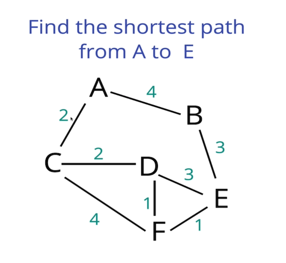

# Djikstra's Algorithm
## Question
A graph containing vertices A,B,C,D,E,F, with the edges of weight:

|   EDGE   | WEIGHT |
|----------|--------|
|   A-B    |   4    |
|   A-C    |   2    |
|   C-D    |   2    |
|   C-F    |   4    |
|   D-E    |   3    |
|   D-F    |   1    |
|   F-E    |   1    |
|   B-E    |   3    |

### Image representation

## Hint
1. Take minimum path from each node to the source node.
2. Take note of total distance for the child nodes of the minimum path.

## Walk through
NB: Crossed out vertices in the minimum distance container are those that are visited.
- Set container for visited vertices.
- Set container containing vertex with its corresponding minimum distance. Intial distance for vertex A is 0 and for the remaining vertices is Infinity.
- Set container mapping path from each node back to A basing on the minimum distance travelled. Initial path for all the nodes is null.

### Representation
#### Visited
`visited = {}`

#### Minimum Distance from A

| Vertex | Distance |
|--------|----------|
|   A    | 0        |
|   B    | Infinity |
|   C    | Infinity |
|   D    | Infinity |
|   E    | Infinity |
|   F    | Infinity |

#### Path travelled from A to vertex

| Vertex | Previous Vertex |
|--------|-----------------|
|   A    | NULL            |
|   B    | NULL            |
|   C    | NULL            |
|   D    | NULL            |
|   E    | NULL            |
|   F    | NULL            |

- Starting from A, mark A as visited and get the nearest neighbours of A, which in this case are B and C. Add the distances of B and C from A to the Minimum distance container and mark the previous vertex for B and C as A.

### Representation
#### Visited
`visited = {A}`

#### Minimum Distance from A

| Vertex | Distance |
|--------|----------|
| ~~A~~  | 0        |
|   B    | 4        |
|   C    | 2        |
|   D    | Infinity |
|   E    | Infinity |
|   F    | Infinity |

#### Path travelled from A to vertex

| Vertex | Previous Vertex |
|--------|-----------------|
|   A    | NULL            |
|   B    | A               |
|   C    | A               |
|   D    | NULL            |
|   E    | NULL            |
|   F    | NULL            |

- Take the vertex with the minimum distance from A for the non visited vertices in the minimum distance container. In this scenario the we would take C as it has the smaller distance from A when you compare with the other vertex B
- Add C to visited and get the nearest neighbours of C that are not visited, which in this case are D and F. Add the distances of D and F from A through C to the Minimum distance container and mark the previous vertex for D and F as C.

### Representation
#### Visited
`visited = {A, C}`

#### Minimum Distance from A

| Vertex | Distance |
|--------|----------|
| ~~A~~  | 0        |
|   B    | 4        |
| ~~C~~  | 2        |
|   D    | 4        |
|   E    | Infinity |
|   F    | 6        |

#### Path travelled from A to vertex

| Vertex | Previous Vertex |
|--------|-----------------|
|   A    | NULL            |
|   B    | A               |
|   C    | A               |
|   D    | C               |
|   E    | NULL            |
|   F    | C               |

- Take the vertex with the minimum distance from A for the non visited vertices in the minimum distance container. This would be B.
- Add B to visited and get the nearest neighbours of B that are not visited, which is E. Add the distance of E from A through B to the Minimum distance container and mark the previous vertex for E as B

### Representation
#### Visited
`visited = {A, C, B}`

#### Minimum Distance from A

| Vertex | Distance |
|--------|----------|
| ~~A~~  | 0        |
| ~~B~~  | 4        |
| ~~C~~  | 2        |
|   D    | 4        |
|   E    | 7        |
|   F    | 6        |

#### Path travelled from A to vertex

| Vertex | Previous Vertex |
|--------|-----------------|
|   A    | NULL            |
|   B    | A               |
|   C    | A               |
|   D    | C               |
|   E    | B               |
|   F    | C               |

- Vertex with minimum distance from A for non visited vertices i.e D
- Add D to visited and get the nearest neighbours of D that are not visited, which are E and F.
  - The distance of E through D, C and A is 7 which is equal to the current minimum distance for reaching E through B. Basing on this we do not need to modify the minimum distance container and the path travelled container for vertex E.
  - The distance of F through D, C and A is 5 which is less than that in the minimum distance container. We change the distance of F to 5 and update the previous vertex for F to D

### Representation
#### Visited
`visited = {A, C, B, D}`

#### Minimum Distance from A

| Vertex | Distance |
|--------|----------|
| ~~A~~  | 0        |
| ~~B~~  | 4        |
| ~~C~~  | 2        |
| ~~D~~  | 4        |
|   E    | 7        |
|   F    | 5        |

#### Path travelled from A to vertex

| Vertex | Previous Vertex |
|--------|-----------------|
|   A    | NULL            |
|   B    | A               |
|   C    | A               |
|   D    | C               |
|   E    | B               |
|   F    | D               |

- Vertex with minimum distance from A for non visited vertices i.e F
- Add F to visited and get the nearest neighbours of F that are not visited, which is E. The distance of E through F, D, C and A is 6 which is less than that in the minimum distance container. We change the distance of E to 6 and cupdate the previous vertex for E to F

### Representation
#### Visited
`visited = {A, C, B, D, F}`

#### Minimum Distance from A

| Vertex | Distance |
|--------|----------|
| ~~A~~  | 0        |
| ~~B~~  | 4        |
| ~~C~~  | 2        |
| ~~D~~  | 4        |
|   E    | 6        |
| ~~F~~  | 5        |

#### Path travelled from A to vertex

| Vertex | Previous Vertex |
|--------|-----------------|
|   A    | NULL            |
|   B    | A               |
|   C    | A               |
|   D    | C               |
|   E    | F               |
|   F    | D               |

- Vertex with minimum distance from A for non visited vertices i.e E
- Since we were tasked with finding the shortest path from A to E, when we visit E, we have the shortest path from A to E within the path travelled container. We just have to traverse backwards from node E to A to get the path travelled. The distance covered is got from the minimum distance container.

## Structure
- Since we always have to get the minimum distance of the vertices from A using the Minimum Distance container, we would need to structure the minimum distance container to always pop the vertex with the minimum distance. To optimize the input and output of the minimum value from the container, it'd be better to use a priority queue for the minimum distance container. We could also use an array for the minimum container and alway sort it after insertion, but this will make the time complexity at be O(nlogn) while that of the priority queue is O(logn).
- A separate container containing key value pairs can be used to store the minimum distance from A to the vertex. This can be updated whenever the priority queue pops a value. (This is to ensure we do not lose the minimum distance for each vertex when we empty the priority list and for comparision of a current vertex new distance with a previous distance);
- For the path travelled container we would need a key value pair, data structure. For java we can use the hash map.
- For the visited container, we can use an array if we are optimising for space, but this will mean determining that an item has been visited would take a time complexity of O(n) where n is the number of items in the array at each check. The better option would be to use a map where the keys are the visited vertices. This means that the time complexity is O(1), but the space will be 2n.

